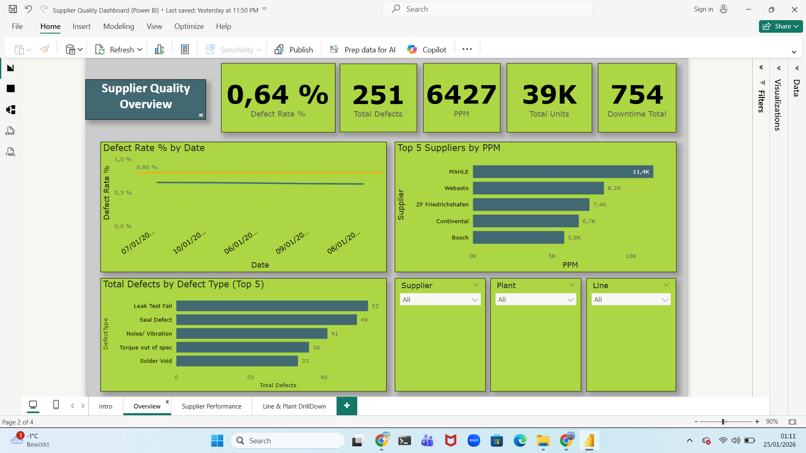
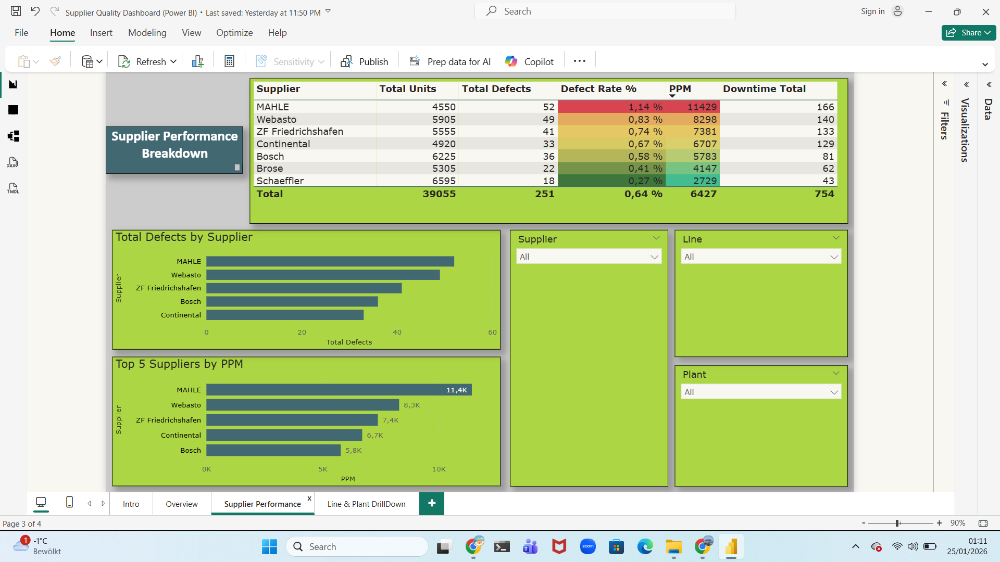
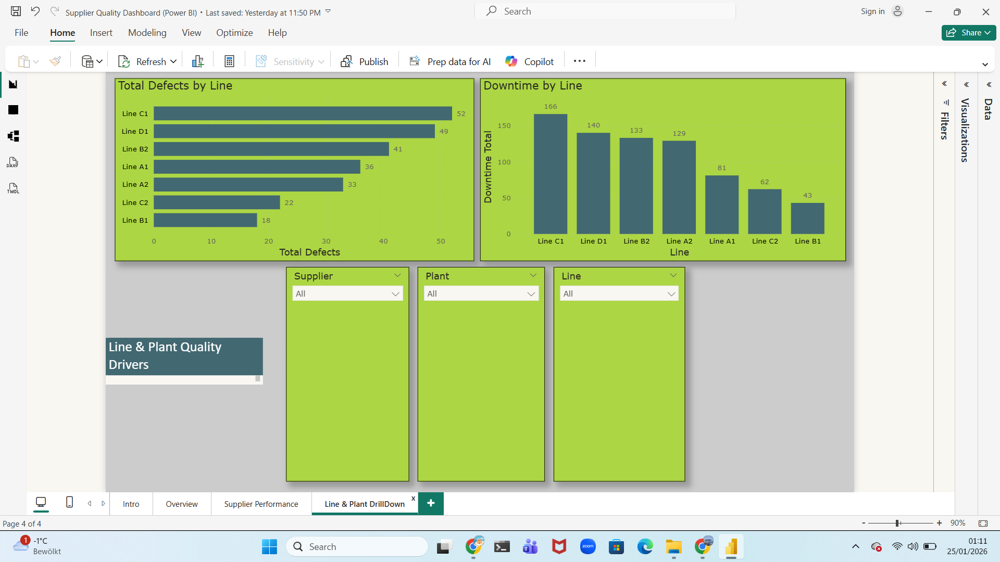

# Supplier Quality & Production KPI Dashboard (Power BI)

Automotive-style Power BI dashboard to monitor supplier quality and production KPIs and identify defect and downtime drivers.

## KPIs
- Defect Rate (%)
- PPM (defects per 1M units)
- Total Defects
- Total Units
- Downtime (minutes)

## Report Pages
1. **Executive Overview** – KPI snapshot, defect trend vs target, Top-N suppliers and defect types  
2. **Supplier Performance** – supplier ranking table + defects/PPM comparison  
3. **Line & Plant Drilldown** – defects and downtime by line to identify bottlenecks  

## Screenshots

### Executive Overview

### Supplier Performance

### Line & Plant Drilldown

## Tools
Power BI Desktop, DAX, Power Query
## How to use
1. Download the PBIX from `dashboard/`
2. Open in Power BI Desktop
3. Use slicers (Supplier / Plant / Line / Date) to filter results

## Repository Structure
- `dashboard/` – PBIX report + exported PDF  
- `screenshots/` – report screenshots used in the README

